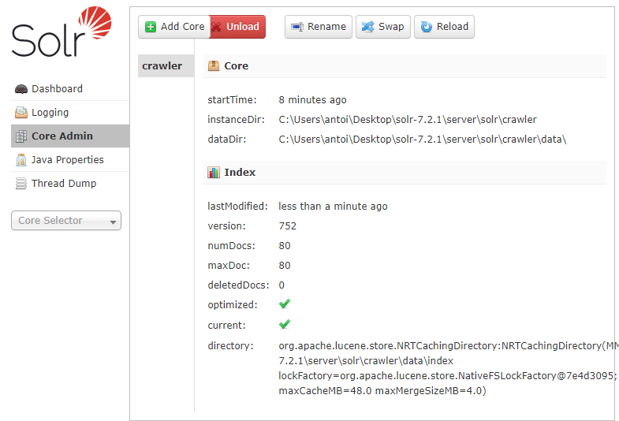
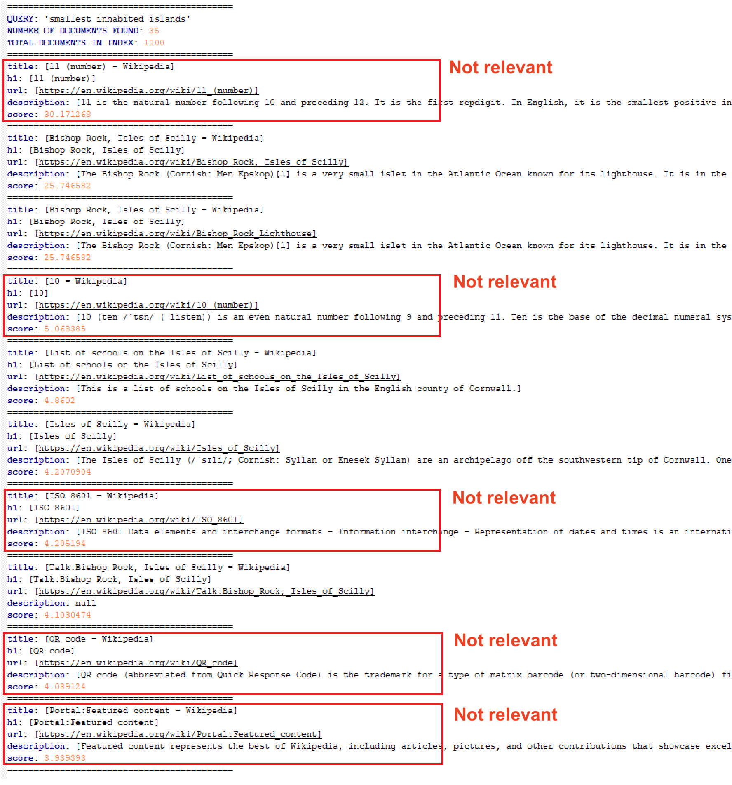

# WEM - Lab 1 - Crawling, indexing and searching web pages

## 1. Crawler2
The crawler starts from a specific wikipedia page and crawls a certain amount 
of outgoing links (see crawler configs).

In this step we build the Java class "Crawler2" which performs the crawling and indexing
of found documents in Solr. To communicate with Solr and the crawler, we use Solrj API
and to build the crawler we use crawler4j.

In Solr, the core is named "crawler" and the index built contains 80 documents which is the limit we set with the function `setMaxPagesToFetch()`:


## 2. More precise indexing
A more precise Solr index was needed in order to return more relevant results during
searching. 
We selected the principal components of web pages during the crawling 
by parsing their html content with [jSoup](https://jsoup.org/). The following elements
are retrieved :


- `<title>` : The title of the page, strongest element defining in few words the topic
of the page.
- `<h1>` : First hierarchical order in html body. Gives also a strong indication of
its content. Usually similar to the title.
- First `<p>` : Contains a relevant descriptive summary of the topic.

We also explore the `categories` sections which gives a powerful weight 
for searching as its content is related to the topic.


Naturally, the choice of these elements are specific to the domain we target. 
Here we know we are parsing wikipedia html pages, which all have the same structure
so with jsoup we use tag names and ids to identify easily the elements.

Additionally, we store the `url` as we want to be able to visit the page containing the
information and `content` which is all the text content of the `<body>`.

## 3. Searching
After indexing was successfully built, let's try the searching.
Here we perform two queries with Solr tool:

1. Default query `q(*:*)` : returns all the 80 documents


2. Search for `Isles of Scilly` in title `q(title h1:Isles of Scilly)` : returns 
12 documents


Then we build this search functionality in Java class `Search.java` which 
additionally returns the score for each document. To give more weight to the elements
we previously extracted, we use specific lucene syntax :
```
q:(title:<qry> OR h1:<qry>)^5 (description:<qry>)^3 (categories:<qry>)^2 (content:<qry>)^1
```
where `<qry>` is replaced with the query made by the user. 
More power is given using the exponent. The query is passed as the arguments of the
executing class.

As an example, let's search again for `Isles of Scilly` using our little program.
It shows the 10 first documents found.


If we search for `smallest inhabited islands` it returns 5 documents where 2 are not
relevant. However the score of the first one, which is the wanted document, is much higher
than the others thanks to the weight given for title, h1 and description.



## 4 Theoretical questions

- **Please explain which strategy to adopt for indexing multilingual pages 
(each page contains its own language but the corpus contains pages in many 
different languages). What must be particulary taken care of ?
Explain how you would do it.**

  We see 3 possibilities (from the easiest to the most difficult to implement):
  1. For sites that can have seperate url for each language,
  execute two different crawlers sequentially by specifying for each the
  target domain to visit (all urls that start with this target domain should be
  visited only). For example for Wikipedia all french pages start 
  with `https://fr.wikipedia.org` (notice the **fr**) while all english pages start
  with `https://en.wikipedia.org`. All the crawlers connect to the same Solr core
  to build the index with multilingual pages.
  2. For sites that do not seperate url for each language, the crawler should
  modify its HTTP request with an Accept-Language field set in the HTTP header,
  accordingly to the language we want to index. Rerun the crawler for each different
  language. However, if the visited page doesn't take care of the wanted language,
  then the default one will be displayed. This case should be handled by the crawler to
  avoid inserting the same page and language multiple times.
  3. Also for sites that do not seperate url for each language, a crawler could be
  run from different geographic location. The visited page understand the origin
  of the ip of the crawler and display its page in the appropriate language. Again,
  the crawler should take care of default languages.
  
- **Solr do by default fuzzy search. Explain what it is and how Solr implements it. 
Some firstnames may have many spelling variations (for example Caitlin : 
Caitilin, Caitlen, Caitlinn, Caitlyn, Caitlyne, Caitlynn, Cateline, Catelinn, 
Catelyn, Catelynn, Catlain, Catlin, Catline, Catlyn, Catlynn, Kaitlin, Kaitlinn, 
Kaitlyn, Kaitlynn, Katelin, Katelyn, Katelynn, etc). 
Is it possible to use Solr's fuzzy search to make a search taking care of these variations, 
while keeping still a good performance? If not, which alternative(s) do you see ? Justify your answer.**

  Fuzzy search discover terms that are similar to a specified term without necessarily being an exact match.
  You specify an allowed maximum edit distance, and Solr searches any terms within that edit distance from the base term 
  (and, then, the docs containing those terms) are matched. the score corresponds to the similarity of the original word 
  with each generated word. The highest scores represent bigger similarity.
 
  Taking care of all the variations of Caitlin is possible. We have to use the `~` opertor and specify and distance
  of 2 like so : `aitlin~2`. If it does not cover enough variations we can combine fuzzy searches with `OR` operator :
  `Caiteli~2 OR Katelyn~2`.
  
  However, in many cases, stemming will produce the same results as fuzzy search.
  
  Sources :
  
  - [https://stackoverflow.com/questions/16655933/fuzzy-search-in-solr](https://stackoverflow.com/questions/16655933/fuzzy-search-in-solr)
  - [https://lucene.apache.org/solr/guide/6_6/the-standard-query-parser.html#TheStandardQueryParser-FuzzySearches](https://lucene.apache.org/solr/guide/6_6/the-standard-query-parser.html#TheStandardQueryParser-FuzzySearches)

## Dependencies

The following libraries are used in this project :

- crawler4j 4.3 [https://github.com/yasserg/crawler4j](https://github.com/yasserg/crawler4j)
- solrj 7.2.1 [https://lucene.apache.org/solr/guide/7_1/using-solrj.html](https://lucene.apache.org/solr/guide/7_1/using-solrj.html)
- jsoup 1.11.2 [https://jsoup.org/](https://jsoup.org/)

The libraries are also all listed in the pom.xml.