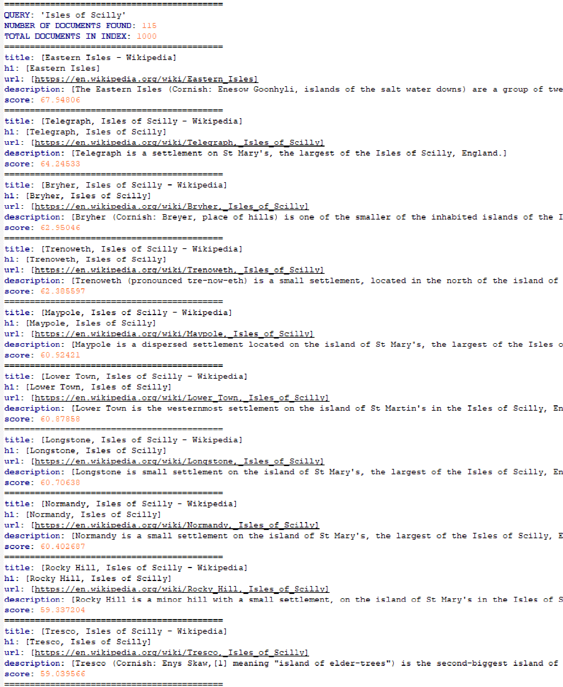

# WEM - Lab 1 - Crawling, indexation et recherche de pages web

*Mars 2018 - Antoine Drabble & Sébastien Richoz*

## Introduction

Le but de ce laboratoire est de crawler un site web et d'indexer les pages visitées dans un core Solr, puis d'y effectuer une recherche. Ces tâches se feront en Java avec l'API Solrj ainsi que les librairies crawler4j pour crawler les pages web, et jsoup pour parser leur contenu HTML afin d'en extraire les informations que nous jugeons importantes.

Avant de commencer, il faut intaller et démarrer Solr en local.

Les deux cores que nous avons utilisé se nomment core1 et core2 et leurs configurations se trouvent dans le dossier core_configuration à la racine du projet.

## 1. Crawler

Pour cette première partie, il s'agit d'abord de créer un core Solr que nous avons nommé **core1** avec la commande `$ bin/solr create -c core1`. Ce core n'a pas de configuration partiuclière, c'est le core par défaut de Solr. Le fichier `Crawler1.java` se charge de crawler et d'indexer le contenu des pages visitées pour ce core.

Le crawler commence depuis une page spécifique Wikipedia (seed) `https://en.wikipedia.org/wiki/Bishop_Rock,_Isles_of_Scilly` et visite un nombre de page maximum de 80 pages tout en se limitant à une profondeur de 2 et en restant dans le domaine de Wikipedia (voir la configuration dans `Crawler1.java`) étant donné que c'est le site que nous souhaitons indexer.

À chaque page visitée, nous indexons son contenu dans Solr. À la fin des opérations, nous pouvons constater que le core1 a été indexé avec 80 documents comme défini dans la configuration.


Pour le reste de la configuration du crawler, nous avons défini un politeness delay de 500ms soit 0.5 secondes entre chaque requêtes afin de ne pas risquer de se faire blacklister, nous avons désactivé l'inclusion de données binaires et activer l'inclusion de pages https.

Dans la méthode `shouldVisit` nous excluons tous les fichiers ayant une extension contenue dans la constante `FILTERS` définie dans le fichier `Config.java` et toutes les pages dont l'adresse ne commence pas par le domaine cible aussi défini dans le fichier `Config.java`.

La méthode `visit` du crawler 1 récupère la page HTML, la parse à l'aide de la librairie jSoup, crée un document Solr avec le champ id (hashcode de la page) et le champs text_en (contenu text de la page) et envoie le document à Solr.

Le commit de l'envoi des documents Solr se fait seulement tous les 50 documents récupérés afin de diminuer la charge. L'envoi se fait à l'aide de la classe `SolrClient`, plus précisément sa sous-classe `ConcurrentUpdateSolrClient` qui gère la concurrence car le crawler peut utiliser plusieurs threads. Dans notre code, nous définissons le nombre de thread à l'aide de `Runtime.getRuntime().availableProcessors();`

## 2. Indexation spécialisée

Pour cette seconde partie, un deuxième core **core2** a été créé afin de stocker du contenu plus spécifique aux pages Wikipedia, dans le but d'effectuer des recherches plus efficaces en mettant l'accent sur des termes plus importants.

Nous avons sélectionné les composantes principales des pages web pendant le crawling en parsant leur contenu HTML avec [jSoup](https://jsoup.org/). Voici les éléments retenus :


- `<title>` : Le titre de la page, élément le plus fort définissant en peu de mots le sujet de la page.
- `<h1>` : Premier élément hiérarchique du corps de l'HTML. Donne également le sujet de la page. Semblable au titre.
- Premier paragraphe `<p>` : Contient un résumé descriptif très relevant du sujet.

Nous explorons également la section des catégories qui donne un poids important à la recherche étant donné que le contenu est relatif au sujet.


Et la class `infobox` qui est un tableau qui contient souvent des informations utiles sur le sujet de la page. Par exemple pour les iles de Scilly il y a la localisation, les coordonnées, la population et sa densité, etc.


Naturellement, le choix de ces éléments est spécifique au domaine que nous ciblons. Dans ce cas nous savons que nous sommes entrain de parser des pages HTML Wikipedia, qui ont presque toutes la même structure. Nous utilisons donc jSoup avec les id et les noms des balises pour identifier facilement les éléments.

De plus, nous stockons l'url étant donné que nous voulons accéder à la page contenant l'information recherchée, ainsi que le contenu de cette page qui est tout le texte présent dans la balise `<body>`.

Le core2 contient quant à lui plus de documents. Nous avons limité l'index à 1000 documents et supprimé la limitation de la profondeur afin d'être sûr de récupérer le maximum de documents.

Le reste de sa configuration est similaire au crawler 1, à part pour sa fonction `visit` qui parse les pages HTML avec jSoup et qui les insère dans Solr dans leurs champs spécifiques.

## 3. Recherche

Une fois l'index construit, testons la recherche. Ici nous exécutons deux requêtes dans l'outil Solr :

1. Recherche par défaut `q(*:*)` : retourne les 1000 documents


2. Recherche avec un mot présent dans l'index : `Isles of Scilly`. Si nous respectons la logique et que nous tapons `*:Isles of Scilly`, nous voyons que cela ne fonctionne pas. Il faut préciser le nom des champs dans lesquels la recherche doit se faire : `title h1:Isles of Scilly`. Il doit être possible de modifier cela au niveau du RequestHandler du fichier conf/solrconfig.xml pour qu'il sache par défaut sur quels champs effectuer la recherche.


Ensuite nous avons implémenté cette fonctionnalité de recherche dans la classe `Search.java` qui retourne en plus le score pour chaque document retourné. Pour donner plus d'importance dans le titre et les champs récupérés au point précédent, nous utilisons la syntaxe spécifique de lucene:

```
q:(title:<qry> OR h1:<qry>)^5 (description:<qry>)^3 (infobox:%s)^2
(categories:<qry>)^1.6 (content:<qry>)^1
```
où `<qry>` est la requête de l'utilisateur. L'importance est donné par l'exposant. Plus il est grand, plus l'importance l'est aussi. La requête est passé en argument de la classe Search.java.

Voici les 10 premiers documents retournés d'une recherche avec `Isles of Scilly`.



Si nous cherchons `smallest inhabited islands` cela retourne 35 documents dont 5 non relevants sur les 10 premiers. Les 3 premiers ont un score beaucoup plus élevé que le reste et les deux pages relevantes s'y trouvent. Nous ne comprenons par contre pas pourquoi la page wikipedia sur le chiffre 11 vient en premier. Elle ne contient aucun mot ressemblant à inhabited ou à island et ne contient que 2 fois le mot smallest.


Notre application de recherche utilise un simple `HttpSolrClient` de la librairie Solrj afin de communiquer avec le serveur Solr. Cette application prend en paramêtres (arguments) les termes qui doivent être recherché sur le core 2 de Solr, préalablement rempli par le crawler 2. Elle utilise un objet de type `MapSolrParams` qui contient la requête définie ci-dessus avec ses différents paramêtres et est envoyée à l'aide du client Solrj. Finalement son résultat est affiché à l'écran.

## 4. Questions théoriques

- **Veuillez expliquer quelle stratégie il faut adopter pour indexer des pages dans plusieurs langues (chaque page est composée d’une seule langue, mais le corpus comporte des pages dans plusieurs langues). A quoi faut-il faire particulièrement attention ? Veuillez expliquer la démarche que vous proposez.**

  Pour le crawling, nous voyons 3 possibilités de la plus facile à la plus difficilement réalisable selon nous:

  1. Pour les sites avec des urls séparées pour chaque langue, exécuter deux crawlers différents en restreignant pour
  chacun le domaine cible à la langue voulue. Par example pour Wikipedia les pages en français commencent par
  `https://fr.wikipedia.org` (notons le **fr**) alors que les pages en anglais commencent par `https://en.wikipedia.org`.
  Par contre, si la page visitée ne prend pas en compte la langue demandée,
  elle va être retournée dans une autre langue, et dans ce cas il ne faudra pas l'enregistrer sous la mauvaise langue.
  Pour savoir si la langue retournée est celle qu'on a demandé on peut se baser sur trois choses. Le header `Content-Language`
  dans la réponse HTTP retournée par le serveur, l'attribut lang dans la balise html `<html lang="en">` ou encore à l'aide
  d'un outil qui permet de detecter la langue d'un texte.

  2. Pour les sites qui ne gère pas la langue dans l'url, le crawler peut modifier ses requêtes HTTP en précisant
  la langue dans le champ `Accept-Language` des headers HTTP. Il devra ensuite faire une requête pour chaque
  langue en modifiant à chaque fois les headers.
  Il faudra denouveau faire attention aux langues non supportées.

  3. Pour les sites qui se basent sur la localisation géographique, il est possible de modifier son IP,
  par exemple à l'aide d'un VPN. Les requêtes que nous enverrons arriveront donc par le biais d'une autre IP et le site
  sera affiché dans une autre langue qui correspond à la localisation de l'IP.
  Il faudra denouveau faire attention aux langues non supportées.

  Ensuite pour l'indexation, en utilisant un seul corpus qui contient plusieurs langues, il faut modifier le schéma Solr
  et les fichiers solrconfig. Le point 2) du blog de Pavlo Bogomolenko
  (http://pavelbogomolenko.github.io/multi-language-handling-in-solr.html) nous explique en détail la manipulation mais
  de manière générale il s'agit de définir les langues puis d'associer à chaque champ sa langue, en gardant un champ pour
  la langue par défaut.

- **Solr permet par défaut de faire de la recherche floue (fuzzy search). Veuillez expliquer de quoi il s’agit et comment Solr l’a implémenté. Certains prénoms peuvent avoir beaucoup de variation orthographiques (par exemple Caitlin : Caitilin, Caitlen, Caitlinn, Caitlyn, Caitlyne, Caitlynn, Cateline, Catelinn, Catelyn, Catelynn, Catlain, Catlin, Catline, Catlyn, Catlynn, Kaitlin, Kaitlinn, Kaitlyn, Kaitlynn, Katelin, Katelyn, Katelynn, etc). Est-il possible d’utiliser, tout en gardant une bonne performance, la recherche floue mise à disposition par Solr pour faire une recherche prenant en compte de telles variations ? Sinon quelle(s) alternative(s) voyez-vous, veuillez justifier votre réponse.**

  La recherche fuzzy search découvre les termes qui sont similaires pour une requête sans forcément avoir un correspondance exacte.
  On peut spécifier une distance de modification maximum et Solr va rechercher tous les termes qui sont dans cette distance de modification
  à partir du terme de base de la recherche. Le score des recherches sera relatif à la similarité entre le mot original
  et le mot modifié. Plus le mot modifié est proche du mot originel, plus le score sera haut.

  Pour prendre en compte toutes les variations de Caitlin, il faut utiliser l'operateur `~` et spécifier une distance de 2
  commme ça : `aitlin~2`. Si ça ne couvre pas assez de variations, on peut combiner le fuzzy search avec l'opérateur `OR`:
  `Caiteli~2 OR Katelyn~2`.

  Dans beaucoup de cas, le stemming peut donner des résultats similaires au fuzzy search.
  Il y a aussi la lemmatization.

  Sources :

  - [https://stackoverflow.com/questions/16655933/fuzzy-search-in-solr](https://stackoverflow.com/questions/16655933/fuzzy-search-in-solr)
  - [https://lucene.apache.org/solr/guide/6_6/the-standard-query-parser.html#TheStandardQueryParser-FuzzySearches](https://lucene.apache.org/solr/guide/6_6/the-standard-query-parser.html#TheStandardQueryParser-FuzzySearches)

## Conclusion

Ce labo nous a permis de comprendre comment constuire un index Solr en effectuant un crawling du web et en indexant du contenu spécifique.

Le crawler que nous avons obtenu fonctionne comme nous le voulions.

Nous avons rencontré un problème où nous n'obtenions que ~970 documents à la fin du crawling sur 1000 documents. Cela venait du fait que certaines pages wikipedia ne contiennent pas de balise `<p>` avec la description ou pas de tableau infobox. Nous avons pris du temps à identifié la source du problème à cause de la quantité d'output que produit le crawler. Nous avions d'abord suspecté que le problème venait de la concurrence ou du nombre de pages accessible depuis la page wikipedia que nous avions choisie.

Pour le recherche (partie 3) nous avons plusieurs résultats non relevants qui apparaissent dans les 10 premiers résultats, notamment la page wikipedia sur le chiffre 11 qui a un grand score contrairement aux autres documents non relevants. Nous n'avons, à ce jour, pas détérminé la cause de cette erreur.

## Dépendances

Les librairies suivantes ont été utilisées :

- crawler4j 4.3 [https://github.com/yasserg/crawler4j](https://github.com/yasserg/crawler4j)
- solrj 7.2.1 [https://lucene.apache.org/solr/guide/7_1/using-solrj.html](https://lucene.apache.org/solr/guide/7_1/using-solrj.html)
- jsoup 1.11.2 [https://jsoup.org/](https://jsoup.org/)

Ces librairies sont également listées dans le `pom.xml`.
