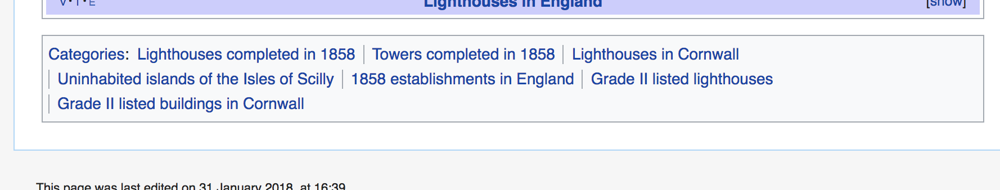
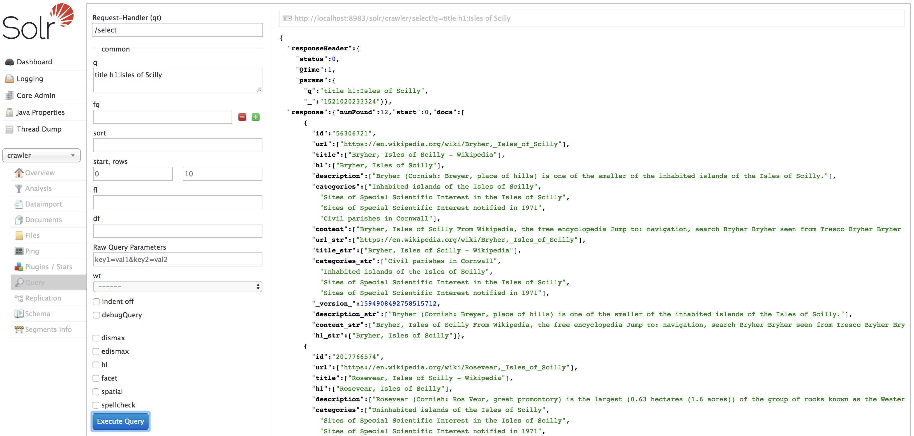

# WEM - Lab 1 - Crawling, indexation et recherche de pages web

*Mars 2018 - Antoine Drabble & Sébastien Richoz*

## Introduction

Le but de ce laboratoire est de crawler un site web et d'indexer les pages visitées dans un core Solr, puis d'y effectuer une recherche. Ces tâches se feront en Java avec l'API Solrj ainsi que les librairies crawler4j pour crawler les pages web, et jsoup pour parser leur contenu HTML afin d'en extraire les informations que nous jugeons importantes.

Avant de commencer, il faut intaller et démarrer Solr en local.

## 1. Crawler

Pour cette première partie, il s'agit d'abord de créer un core Solr que nous avons nommé **core1** et créé avec la commande `$ bin/solr create -c core1`. Ce core n'a pas de configuration partiuclière, c'est le core par défaut de Solr. Le fichier `Crawler1.java` se charge de crawler et d'indexer le contenu des pages visitées pour ce core.

Le crawler commence depuis une page spécifique Wikipedia `https://en.wikipedia.org/wiki/Bishop_Rock,_Isles_of_Scilly` et visite un nombre de page maximum tout en se limitant à une certaine profondeur et en restant dans le domaine de Wikipedia (voir la configuration dans `Crawler1.java`) étant donné que c'est le site que nous souhaitons indexer.

À chaque page visitée, nous indexons son contenu dans Solr. À la fin des opérations, nous pouvons constater que le core1 a été indexé avec le nombre de documents paramétré.


## 2. Indexation spécialisée

Pour cette seconde partie, un deuxième core **core2** a été créé afin de stocker du contenu plus spécifique aux pages Wikipedia, dans le but d'effectuer des recherches plus efficaces en mettant l'accent sur des termes plus importants.

Nous avons sélectionné les composantes principales des pages web pendant le crawling en parsant leur contenu HTML avec [jSoup](https://jsoup.org/). Voici les éléments retenus :


- `<title>` : Le titre de la page, élément le plus fort définissant en peu de mots le sujet de la page.
- `<h1>` : Premier élément hiérarchique du corps de l'HTML. Donne également le sujet de la page. Semblable au titre.
- Premier paragraphe `<p>` : Contient un résumé descriptif très relevant du sujet.

Nous explorons également la section des catégories qui donne un poids important à la recherche étant donné que le contenu est relatif au sujet.



Et la class `infobox` qui est un tableau qui contient souvent des informations utiles sur le sujet de la page. Par exemple pour les iles de Scilly il y a la localisation, les coordonnées, la population et sa densité, etc.


Naturellement, le choix de ces éléments est spécifique au domaine que nous ciblons. Dans ce cas nous savons que nous sommes entrain de parser des pages html Wikipedia, qui ont toutes la même structure. Nous utilisons donc jSoup avec les id et les noms des balises pour identifier facilement les éléments.

De plus, nous stockons l'url étant donné que nous voulons accéder à la page contenant l'information recherchée, ainsi que le contenu de cette page qui est tout le texte présent dans la balise `<body>`.

Le core2 contient quant à lui plus de documents. Nous avons limité l'index à 1000 documents et supprimé la limitation de la profondeur afin d'être sur de récupérer au moins 1000 documents.

## 3. Recherche

Une fois l'index construit, testons la recherche. Ici nous exécutons deux requêtes dans l'outil Solr :

1. Recherche par défaut `q(*:*)` : retourne les 1000 documents


2. Recherche avec un mot présent dans l'index : `Isles of Scilly`. Si nous respectons la logique, nous voyons que cela ne fonctionne pas. Il faut préciser le nom des champs dans lesquels la recherche doit se faire : `title h1:Isles of Scilly`.



Ensuite nous avons implémenté cette fonctionnalité de recherche dans la classe `Search.java` qui retourne en plus le score pour chaque document retourné. Pour donner plus d'importance dans le titre et les champs récupérés au point précédent, nous utilisons la syntaxe spécifique de lucene:

```
q:(title:<qry> OR h1:<qry>)^5 (description:<qry>)^3 (infobox:%s)^2 (categories:<qry>)^1.6 (content:<qry>)^1
```
où `<qry>` est la requête de l'utilisateur. L'importance est donné par l'exposant. Plus il est grand, plus l'importance l'est aussi. La requête est passé en argument de la classe Search.java.

Voici les 10 premiers documents retournés d'une recherche avec `Isles of Scilly`.


Si nous cherchons `smallest inhabited islands` cela retourne 33 documents dont 3 non relevants sur les 10 premiers. Cependant le score des premiers, qui est le document voulu, est bien meilleur que les autres grâce aux poids donné au titre, h1 et au premier paragraphe.


## 4. Questions théoriques

- **Veuillez expliquer quelle stratégie il faut adopter pour indexer des pages dans plusieurs langues (chaque page est composée d’une seule langue, mais le corpus comporte des pages dans plusieurs langues). A quoi faut-il faire particulièrement attention ? Veuillez expliquer la démarche que vous proposez.**

  Pour le crawling, nous voyons 3 possibilités de la plus facile à la plus difficilement réalisable selon nous:

  1. Pour les sites avec des urls séparées pour chaque langue, exécuter deux crawlers différents en restreignant pour chacun le domaine cible à la langue voulue. Par example pour Wikipedia les pages en français commencent par `https://fr.wikipedia.org` (notons le **fr**) alors que les pages en anglais commencent par `https://en.wikipedia.org`.

  2. TODO traduire: For sites that do not seperate url for each language, the crawler should
  modify its HTTP request with an Accept-Language field set in the HTTP header,
  accordingly to the language we want to index. Rerun the crawler for each different
  language. However, if the visited page doesn't take care of the wanted language,
  then the default one will be displayed. This case should be handled by the crawler to
  avoid inserting the same page and language multiple times.

  3. TODO traduire : Also for sites that do not seperate url for each language, a crawler could be
  run from different geographic location. The visited page understand the origin
  of the ip of the crawler and display its page in the appropriate language. Again,
  the crawler should take care of default languages.

  Ensuite pour l'indexation, en utilisant un seul corpus qui contient plusieurs langues, il faut modifier le schéma Solr et les fichiers solrconfig. Le point 2) du blog de Pavlo Bogomolenko (http://pavelbogomolenko.github.io/multi-language-handling-in-solr.html) nous explique en détail la manipulation mais de manière générale il s'agit de définir les langues puis d'associer à chaque champ sa langue, en gardant un champ pour la langue par défaut.

- **Solr permet par défaut de faire de la recherche floue (fuzzy search). Veuillez expliquer de quoi il s’agit et comment Solr l’a implémenté. Certains prénoms peuvent avoir beaucoup de variation orthographiques (par exemple Caitlin : Caitilin, Caitlen, Caitlinn, Caitlyn, Caitlyne, Caitlynn, Cateline, Catelinn, Catelyn, Catelynn, Catlain, Catlin, Catline, Catlyn, Catlynn, Kaitlin, Kaitlinn, Kaitlyn, Kaitlynn, Katelin, Katelyn, Katelynn, etc). Est-il possible d’utiliser, tout en gardant une bonne performance, la recherche floue mise à disposition par Solr pour faire une recherche prenant en compte de telles variations ? Sinon quelle(s) alternative(s) voyez-vous, veuillez justifier votre réponse.**

  TODO traduire

  Fuzzy search discover terms that are similar to a specified term without necessarily being an exact match.
  You specify an allowed maximum edit distance, and Solr searches any terms within that edit distance from the base term
  (and, then, the docs containing those terms) are matched. the score corresponds to the similarity of the original word
  with each generated word. The highest scores represent bigger similarity.

  Taking care of all the variations of Caitlin is possible. We have to use the `~` opertor and specify and distance
  of 2 like so : `aitlin~2`. If it does not cover enough variations we can combine fuzzy searches with `OR` operator :
  `Caiteli~2 OR Katelyn~2`.

  However, in many cases, stemming will produce the same results as fuzzy search.

  Sources :

  - [https://stackoverflow.com/questions/16655933/fuzzy-search-in-solr](https://stackoverflow.com/questions/16655933/fuzzy-search-in-solr)
  - [https://lucene.apache.org/solr/guide/6_6/the-standard-query-parser.html#TheStandardQueryParser-FuzzySearches](https://lucene.apache.org/solr/guide/6_6/the-standard-query-parser.html#TheStandardQueryParser-FuzzySearches)

## Conclusion

Ce labo nous a permis de comprendre comment constuire un index Solr en effectuant un crawling du web et en indexant du contenu spécifique.

## Dépendances

Les librairies suivantes ont été utilisées :

- crawler4j 4.3 [https://github.com/yasserg/crawler4j](https://github.com/yasserg/crawler4j)
- solrj 7.2.1 [https://lucene.apache.org/solr/guide/7_1/using-solrj.html](https://lucene.apache.org/solr/guide/7_1/using-solrj.html)
- jsoup 1.11.2 [https://jsoup.org/](https://jsoup.org/)

Ces librairies sont également listées dans le `pom.xml`.
